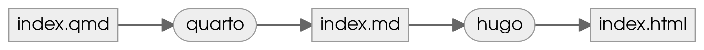

## Workflow :sparkles:

<https://quarto.org/docs/output-formats/hugo.html#workflow>

The basic concept of using Quarto with Hugo is that you take computational markdown documents (.qmd) or Jupyter notebooks (.ipynb) and use them to generate plain markdown files (.md) that are rendered to HTML by Hugo.



<https://mermaid.js.org/syntax/flowchart.html#node-shapes> <https://quarto.org/docs/authoring/diagrams.html#mermaid-formats>

The quarto render and quarto preview commands are used to transform .qmd or .ipynb files to Hugo compatible markdown (.md).

## Polar Axis in Python

-   apparently, the `python3` kernel uses the `conda` `base` env (or rather the currently active env, of course since I am running quarto preview from my interactive session)

-   do i really have to manually build my quarto docs then before deploying them? -\> the .md files to hugo that is

-   cache works

For a demonstration of a line plot on a polar axis, see @fig-polar.

``` python
import numpy as np
import matplotlib.pyplot as plt

r = np.arange(0, 2, 0.01)
theta = 2 * np.pi * r
fig, ax = plt.subplots(subplot_kw={'projection': 'polar'})
ax.plot(theta, r)
ax.set_rticks([0.5, 1, 1.5, 2])
ax.grid(True)
plt.show()
```

## Freeze
