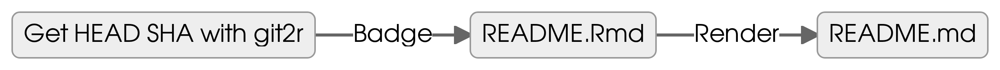
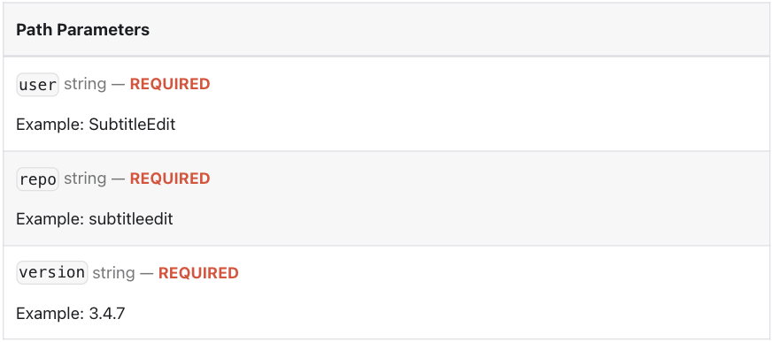

### TL;DR

-   Create a [Shields.io](https://shields.io/ "https://shields.io/")
    badge for your GitHub `README.md` to track the number of commits
    since a specific commit.

-   In my case, I set the base/reference point to the last commit to the
    repo of my blog's
    [theme](https://github.com/adityatelange/hugo-PaperMod/tree/master "hugo-PaperMod")
    which I added as a `git submodule`[^1] to the `themes/` folder of my
    blog[^2].

-   Using [R
    Markdown](https://rmarkdown.rstudio.com/ "https://rmarkdown.rstudio.com/"),
    I have my badge automatically update to the current status of my
    submodule and rendered out to my `README.md`.

-   Finally, I wrap the badge in a link to [GitHub Commit
    Compare](https://docs.github.com/en/pull-requests/committing-changes-to-your-project/viewing-and-comparing-commits/comparing-commits "https://docs.github.com/en/pull-requests/committing-changes-to-your-project/viewing-and-comparing-commits/comparing-commits")
    to quickly see all the recent changes to the theme before I pull
    them.

<figure>
<a href="https://github.com/adityatelange/hugo-PaperMod/compare/71ce72...master"></a>
<figcaption>GitHub commits since tagged
version</figcaption>
</figure>

### How it works

<figure class=''>



</figure>

-   NOTE: you can set up the baseline for this README workflow with `usethis::use_readme_rmd()`

#### Getting the git ref

:link: <https://shields.io/badges/git-hub-commits-since-tagged-version>

``` r

get_theme_sha <- function(theme_dir = NULL) {
    submodule <- git2r::repository(
      path = here::here("themes", theme_dir))
    
    sha <- submodule |> 
      git2r::repository_head() |> 
      git2r::branch_target()
    return(sha)
}

theme_dir <- "PaperMod"
get_theme_sha(theme_dir = "PaperMod")
#> [1] "71ce72b1bfb868b406c369c958f8682c63940e01"

# 
# 

user = "adityatelange"
repo = "hugo-PaperMod"

commit_badge <- function(user = NULL, repo = NULL, sha = NULL) {
  glue::glue("[](https://github.com/{user}/{repo}/compare/{sha}...master)")
}

badge <- commit_badge(user = user, repo = repo, sha = get_theme_sha(theme_dir = "PaperMod"))
```

<figure>
<a href="https://github.com/adityatelange/hugo-PaperMod/compare/71ce72b1bfb868b406c369c958f8682c63940e01...master"></a>
<figcaption>GitHub commits since tagged
version</figcaption>
</figure>

```` markdown
```{r}
[](https://github.com/adityatelange/hugo-PaperMod/compare/71ce72b1bfb868b406c369c958f8682c63940e01...master)
```
````

``` r
knitr::include_url("https://img.shields.io/github/commits-since/adityatelange/hugo-PaperMod/71ce72b1bfb868b406c369c958f8682c63940e01?style=flat&logo=github&label=Commits%20since%20last%20theme%20submodule%20pull", height = "25px")
```

<iframe src="https://img.shields.io/github/commits-since/adityatelange/hugo-PaperMod/71ce72b1bfb868b406c369c958f8682c63940e01?style=flat&amp;logo=github&amp;label=Commits%20since%20last%20theme%20submodule%20pull" width="100%" height="25px" data-external="1">
</iframe>

``` r
knitr::inline_expr('commit_badge(user = "adityatelange", repo = "hugo-PaperMod", sha = get_theme_sha(theme_dir = "PaperMod"))')
#> [1] "`r commit_badge(user = \"adityatelange\", repo = \"hugo-PaperMod\", sha = get_theme_sha(theme_dir = \"PaperMod\"))`"
```

``` r
knitr::include_graphics("https://img.shields.io/github/commits-since/adityatelange/hugo-PaperMod/71ce72b1bfb868b406c369c958f8682c63940e01?style=flat&logo=github&label=Commits%20since%20last%20theme%20submodule%20pull")
```


## The badge

:link: <https://shields.io/badges/git-hub-commits-since-tagged-version>

<!-- Badge Parameter at Shields.io -->



``` r
`r commit_badge(user = "adityatelange", repo = "hugo-PaperMod",
                sha = get_theme_sha(theme_dir = "PaperMod"))`
```

``` r
# alt text for the badge
[![GitHub commits since tagged version]

# {user}/{repo}
(https://img.shields.io/github/commits-since/adityatelange/hugo-PaperMod/

# {version} = SHA for commit
`r base::readLines(here::here(".git", "modules", "themes", "PaperMod", "refs", "heads", "master"))`

?style=flat&logo=github&label=Commits%20since%20last%20theme%20submodule%20pull)]

(https://github.com/adityatelange/hugo-PaperMod/compare/

`r base::readLines(here::here(".git", "modules", "themes", "PaperMod", "refs", "heads", "master"))`...master)
```

<!--  -->

[^1]: Learn more about submodules here:
    <https://git-scm.com/book/en/v2/Git-Tools-Submodules>

[^2]: This blog is based on
    [{blogdown}](https://github.com/rstudio/blogdown "https://github.com/rstudio/blogdown")
    and [Hugo](https://gohugo.io/ "https://gohugo.io/"), which uses a
    very specific [directory
    structure](https://gohugo.io/getting-started/directory-structure/#directories "https://gohugo.io/getting-started/directory-structure/#directories").
